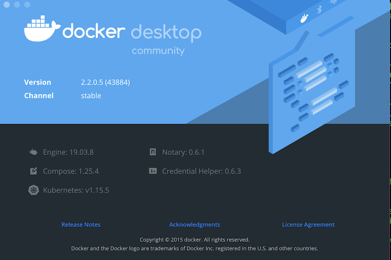
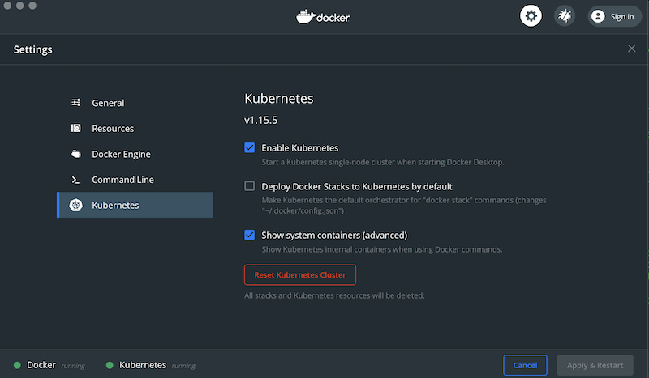

It is relatively easy to setup Kubernetes on Docker and install OpenFaas.
First, ensure that Kubernetes is running in your Docker environment.



ensure that kubernetes is configured



Next clone the OpenFaas repo (this isn't strictly needed, but makes things _way_ easier) and set your location to the repo base.

```powershell
git clone https://github.com/openfaas/faas-netes
set-location faas-netes
```

install the `faas-cli` utility which we will use in the later stages:

```powershell
brew install faas-cli
```

The `kubectl` program is needed for the following steps. It should be available as part of the Docker app.
Set up the needed namespaces:

```powershell
kubectl apply -f ./namespaces.yml
```

This sets up the namespaces for openfaas and openfaas-fn which is where your functions will run.

Next, you need to set up a basic-auth password for the service admin, create all the services needed for openfaas and finally login.

```powershell
$bytes = get-content -asbytestream -totalcount 12 /dev/urandom
$sha = [System.Security.Cryptography.SHA256Managed]::new()
$hash = $sha.ComputeHash($bytes)
$password = [System.BitConverter]::ToString($hash).ToLower().Replace("-","").SubString(0,40)
kubectl -n openfaas create secret generic basic-auth `
    --from-literal=basic-auth-user=admin `
    --from-literal=basic-auth-password="$password"
kubectl apply -f ./yaml
$env:OPENFAAS_URL = "127.0.0.1:31112"
faas-cli login -p "$password"
```

you might see a warning here, this is ok.
Be sure to save the password somewhere, you may need it for subsequent administration sessions.

You can observe the kubernetes pods as follows:

```powershell
PS> kubectl get pod --all-namespaces

NAMESPACE     NAME                                     READY   STATUS    RESTARTS   AGE
docker        compose-7b7c5cbbcc-ldj9j                 1/1     Running   0          6h30m
docker        compose-api-dbbf7c5db-rrpg9              1/1     Running   0          6h30m
kube-system   coredns-5c98db65d4-kcpr9                 1/1     Running   0          6h31m
kube-system   coredns-5c98db65d4-rdhqb                 1/1     Running   0          6h31m
kube-system   etcd-docker-desktop                      1/1     Running   0          6h30m
kube-system   kube-apiserver-docker-desktop            1/1     Running   0          6h30m
kube-system   kube-controller-manager-docker-desktop   1/1     Running   0          6h30m
kube-system   kube-proxy-2n57b                         1/1     Running   0          6h31m
kube-system   kube-scheduler-docker-desktop            1/1     Running   0          6h30m
kube-system   storage-provisioner                      1/1     Running   0          6h30m
openfaas      alertmanager-75c86b8fb5-ws9k8            1/1     Running   0          5h12m
openfaas      basic-auth-plugin-5df9cb99f6-crwt5       1/1     Running   0          5h12m
openfaas      faas-idler-b65944665-fgvtr               1/1     Running   2          5h12m
openfaas      gateway-db946ddcd-s4vht                  2/2     Running   1          5h12m
openfaas      nats-7c4d874896-n4j6c                    1/1     Running   0          5h12m
openfaas      prometheus-758c66f77b-vwvpw              1/1     Running   0          5h12m
openfaas      queue-worker-6b89d664f-m8ls7             1/1     Running   0          5h12m
PS> 
```

Now we can install a couple of openfaas functions.
To see what's available, type the following:

```powershell
PS> faas-cli store list
```

we'll install 2 functions; `figlet` and `nodeinfo`:

```powershell
faas-cli store deploy figlet
faas-cli store deploy nodeinfo
```

now we can invoke the new functions:

```powershell
"OpenFaas!"| faas-cli invoke figlet 
```

you should see some output like:

```powershell
  ___                   _____               _ 
 / _ \ _ __   ___ _ __ |  ___|_ _  __ _ ___| |
| | | | '_ \ / _ \ '_ \| |_ / _` |/ _` / __| |
| |_| | |_) |  __/ | | |  _| (_| | (_| \__ \_|
 \___/| .__/ \___|_| |_|_|  \__,_|\__,_|___(_)
      |_|                                     
```

```powershell
"" | faas-cli invoke nodeinfo
```

with output looking something like this:

```powershell
Hostname: nodeinfo-56b547fd58-85vfg

Arch: x64
CPUs: 2
Total mem: 1990MB
Platform: linux
Uptime: 11776
```